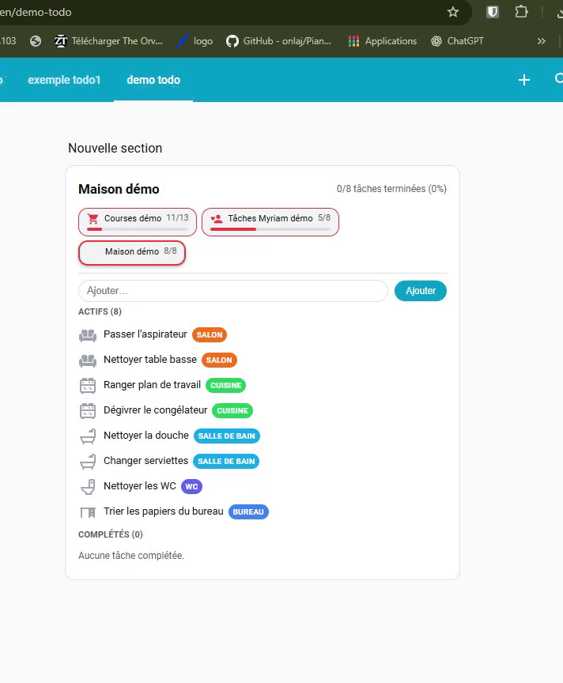
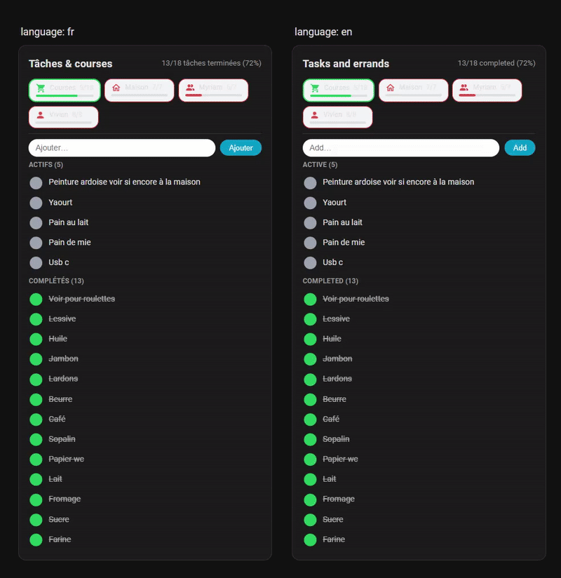

# Raptor Todo Hub Card

> Advanced multi-list **todo** card for Home Assistant – groceries, personal tasks, home chores, urgency tracking and more – all in one place.

---

## 🔥 Key features

- **Multiple todo lists in one card** (tabs)
- **Smart categories**:
  - grocery aisles (fruits, meat, frozen, hygiene…)
  - urgency levels (urgent, soon, normal, long term…)
  - rooms (kitchen, bathroom, garage, outside…)
  - timeframes (today, this week, this month…)
- **Category selector under the input** (chips)
- **Icon click instead of checkboxes**
  - one icon per category (e.g. meat, bathroom, urgent…)
  - OFF / ON colors per category
- **Automatic task removal** after completion
  - delay per list (`auto_remove_completed_seconds`)
  - delay stored inside the task itself
  - still works after HA restart / browser reload / another device
- **Urgency engine based on due date + age**
  - colors based on how late the task is
  - presets for “urgent / soon / normal / long term”
- **Progress bar per tab**
  - color based on completion percentage
  - or based on worst urgency in the list
- **Optional task sorting (NEW)**
  - `sort_by: due` → sort by real Home Assistant due date (`item.due` / `item.due_date`)
  - `sort_by: urgency` → sort by urgency tags in this order: **URGENT → SOON → NORMAL → LONG TERM → NO DUE**
- **Optional due date display (NEW)**
  - `show_due_date: true` (only shows if the item has a due date)
- **Neutral color for empty lists (NEW)**
  - `empty_list_color` (prevents empty lists from showing as “0% red”)

- **Long-press to delete** with confirmation
- **Language-aware labels** (en / fr / de / es)
- Fully compatible with **recent Home Assistant todo services**

---

## 🖼️ Demos (GIF)

### Global overview – multiple lists in one card


---

### Add, complete and delete a task

- Type a task in the input
- (Optionally) pick a category chip
- Click **Add**
- Click the icon to toggle completion
- Long-press on the row to delete the task with confirmation


---

### Urgency mode demo (due date + age)

- Create tasks in a list using the **urgency preset**
- Give them a **due date**
- Watch colors change over time based on how late they are


---

### Rooms categories demo (house chores)

- Each task tagged with a room: `#salon`, `#cuisine`, `#sdb`, …
- Icon and color reflect the room
- Quick overview per area in the house



---

### Sorting demo – due date or urgency (NEW)

- `sort_by: due` sorts by real HA due date (`item.due` / `item.due_date`)
- `sort_by: urgency` sorts by tags in this order: **URGENT → SOON → NORMAL → LONG TERM → NO DUE**
- Sorting applies independently to **ACTIVE** and **COMPLETED** sections


---

# 1. Installation

## 1.1. HACS (recommended)

1. Open **HACS → Frontend**
2. Click **⋮ → Custom repositories**
3. Add the repository:
   ```text
   https://github.com/Inter-Raptor/raptor-todo-hub-card
   ```
4. Category: **Lovelace**
5. Install the card from HACS
6. Reload Lovelace resources (or restart Home Assistant if needed)

If you use HACS, the resource will usually be added automatically.  
Otherwise, add it manually in **Settings → Dashboards → Resources**.

Resource example:
```yaml
url: /hacsfiles/raptor-todo-hub-card/raptor-todo-hub-card.js
type: module
```

---

## 1.2. Manual installation

1. Download `raptor-todo-hub-card.js`
2. Copy it into:
   ```text
   /config/www/raptor-todo-hub-card.js
   ```
3. Add the resource manually in your Lovelace configuration, for example:

```yaml
lovelace:
  resources:
    - url: /local/raptor-todo-hub-card.js
      type: module
```

or via **Settings → Dashboards → Resources** in the UI.

---

# 2. Creating todo lists in Home Assistant

The card works with **any `todo.*` entity** that supports the standard HA todo services.

To create local lists:

1. Go to **Settings → Devices & Services**
2. Click **Add integration**
3. Search for **“Todo List”** or **“Local todo list”**
4. Create several lists, for example:
   - `Courses demo`
   - `Myriam tasks demo`
   - `House chores demo`

The entities will then appear as:
- `todo.courses_demo`
- `todo.taches_myriam_demo`
- `todo.maison_demo`

You can check them under **Developer Tools → States**.

---

# 3. Basic usage

## 3.1. Minimal configuration example

```yaml
type: custom:raptor-todo-hub-card
lists:
  - entity: todo.courses_demo
```

This will:

- show a single tab for your list
- display active and completed tasks
- allow toggling completion by clicking the icon
- show a basic progress bar and stats at the top

---

## 3.2. Example with multiple lists and presets (demo config)

This is the demo card configuration used to create the GIFs:

```yaml
type: custom:raptor-todo-hub-card
language: en
title: Tasks & Groceries – Demo
title_mode: per_list
lists:
  - entity: todo.courses_demo
    label: Demo Groceries
    icon: mdi:cart
    preset: grocery
    default_category: fruits_legumes
    color_mode: category
    tab_color_mode: progress
    show_progress_bar: true
    auto_remove_completed_seconds: 86400   # auto-remove after 24h

  - entity: todo.taches_myriam_demo
    label: Demo Myriam Tasks
    icon: mdi:account-heart
    preset: urgency
    color_mode: urgency_age
    tab_color_mode: mixed
    show_progress_bar: true
    auto_remove_completed_seconds: 0       # do not auto-remove
    urgency_warning_color: "#f97316"       # orange
    urgency_overdue_color: "#ef4444"       # red

  - entity: todo.maison_demo
    label: Demo House
    icon: mdi:home-wrench
    preset: rooms
    color_mode: category
    tab_color_mode: mixed
    show_progress_bar: false
    auto_remove_completed_seconds: 0
```

---

# 4. Global options

These options are set at the **top level** of the card configuration.

| Option           | Type     | Default              | Description |
|------------------|----------|----------------------|-------------|
| `title`          | string   | `Tasks & Groceries`  | Card title shown at the top (used when `title_mode: static`) |
| `title_mode`     | string   | `static`             | How the title is chosen: `static` or `per_list` |
| `language`       | string   | `en`                 | UI language used for preset labels: `en`, `fr`, `de`, `es` |
| `lists`          | array    | **required**         | Array of list configurations (one per tab / todo entity) |
| `progress_colors`| array    | default thresholds   | Global default colors for the progress bar, per completion % |

### 4.1. `title_mode`

- `static` → the card always shows the `title` value
- `per_list` → the card title changes when you switch tabs:
  - prefers `header_title` (if present on the list)
  - then `label`
  - then `name`
  - then the entity’s `friendly_name`
  - finally the raw entity id (e.g. `todo.courses_demo`)

Example:

```yaml
title_mode: per_list
```

### 4.2. `language`

Controls the language used for **preset labels** (grocery, urgency, rooms, timeframe).  
Supported values: `en`, `fr`, `de`, `es`.

If not set, the card tries to use Home Assistant’s locale:

1. `hass.locale.language`
2. `hass.language`
3. falls back to `en`

---

# 5. Per-list options

Each entry in `lists:` controls one tab.

```yaml
lists:
  - entity: todo.courses_demo
    label: Demo Groceries
    icon: mdi:cart
    preset: grocery
    default_category: fruits_legumes
    color_mode: category
    tab_color_mode: progress
    show_progress_bar: true
    auto_remove_completed_seconds: 86400
```

### 5.1. Per-list options table

| Option                        | Type     | Default        | Description |
|-------------------------------|----------|----------------|-------------|
| `entity`                      | string   | **required**   | Todo entity id, e.g. `todo.courses_demo` |
| `label`                       | string   | friendly_name  | Text shown on the tab |
| `name`                        | string   | —              | Alternative label (used if `label` is missing) |
| `header_title`                | string   | —              | Used as title when `title_mode: per_list` |
| `icon`                        | string   | `mdi:format-list-checkbox` | Icon for the tab |
| `preset`                      | string   | —              | Preset to use: `grocery`, `urgency`, `rooms`, `timeframe` |
| `categories`                  | array    | []             | Custom category definitions (merged with preset) |
| `default_category`            | string   | —              | Key of the category to use when none is selected |
| `color_mode`                  | string   | `category`     | `category` or `urgency_age` |
| `tab_color_mode`              | string   | `mixed`        | `progress`, `severity`, or `mixed` |
| `show_progress_bar`           | boolean  | `true`         | Show or hide the progress bar under the tab label |
| `auto_remove_completed_seconds`| number  | `0` (disabled) | If > 0, completed tasks will be auto-removed after that many seconds |
| `urgency_warning_color`       | string   | `#f97316`      | Color for “warning” urgency level (per-list override) |
| `urgency_overdue_color`       | string   | `#ef4444`      | Color for “overdue” urgency level (per-list override) |
| `progress_colors`             | array    | global default | Per-list override for the progress bar color thresholds |

---


---

# 5.2. Sorting tasks (NEW)

Sorting is configured **per list** using `sort_by`:

- `sort_by: none` (default) → keep backend order
- `sort_by: due` → sort by real Home Assistant due date (`item.due` / `item.due_date`)
- `sort_by: urgency` → sort by urgency tags (best with `preset: urgency`)

Urgency order is fixed:

**URGENT → SOON → NORMAL → LONG TERM → NO DUE**

Notes:
- Sorting is applied separately to **ACTIVE** and **COMPLETED** sections.
- `sort_by: due` requires a real due date; tags like `#urg` do **not** count as a due date.
- `show_due_date: true` only displays when the item has a due date.

# 6. Categories & presets

## 6.1. How categories are used

Each category is defined by:

- a **key** (internal name)
- a **match** string (e.g. `#fruits`, `#urg`, `#salon`)
- localized **labels**
- an `icon`
- `color_off` and `color_on`

### When adding a new task

1. You type some text (e.g. `Tomatoes`).
2. You (optionally) click a category chip (e.g. **Fruit & vegetables**).
3. The card appends the category’s `match` token at the end of the text:
   - `Tomatoes #fruits`

Later, when rendering items:

1. The card scans the summary for known `match` tokens.
2. If found, it selects that category.
3. It **strips the token** from the label so you only see `Tomatoes`.
4. It colors the icon and the pill according to the category and urgency.

You can also manually type tokens like `#fruits` or `#salon` at the end of your tasks.

---

## 6.2. Grocery preset (`preset: grocery`)

Designed for shopping lists – about **20 grocery aisles**.

| Key               | Match     | EN label            | Example token |
|-------------------|-----------|---------------------|---------------|
| `fruits_legumes`  | `#fruits` | Fruit & vegetables  | `Tomatoes #fruits` |
| `frais`           | `#frais`  | Chilled / Fresh     | `Yogurt #frais` |
| `surgeles`        | `#surg`   | Frozen              | `Pizza #surg` |
| `boucherie`       | `#bouch`  | Butchery            | `Chicken breast #bouch` |
| `poissonnerie`    | `#poiss`  | Fish                | `Salmon #poiss` |
| `boulangerie`     | `#boul`   | Bakery              | `Baguette #boul` |
| `epicerie_salee`  | `#epis`   | Savory grocery      | `Canned beans #epis` |
| `epicerie_sucree` | `#epid`   | Sweet grocery       | `Chocolate #epid` |
| `pates_riz`       | `#pates`  | Pasta & rice        | `Basmati rice #pates` |
| `conserves`       | `#cons`   | Canned food         | `Tomato sauce #cons` |
| `boissons`        | `#boiss`  | Drinks              | `Juice #boiss` |
| `eau`             | `#eau`    | Water               | `6x water bottles #eau` |
| `petit_dej`       | `#dej`    | Breakfast           | `Cornflakes #dej` |
| `snacking`        | `#snack`  | Snacks              | `Chips #snack` |
| `hygiene`         | `#hyg`    | Hygiene             | `Shampoo #hyg` |
| `beaute`          | `#beaute` | Beauty              | `Lipstick #beaute` |
| `bebe`            | `#bebe`   | Baby                | `Diapers #bebe` |
| `animaux`         | `#anim`   | Pets                | `Cat food #anim` |
| `menage`          | `#men`    | Cleaning            | `Dish soap #men` |
| `entretien`       | `#entretien` | Maintenance      | `Batteries #entretien` |

You can mix these with your own `categories:` array to override icons or colors.

---

## 6.3. Urgency preset (`preset: urgency`)

Used for **time-sensitive tasks**. It works best with `color_mode: urgency_age` and a proper **due date** on tasks.

Categories:

| Key       | Match     | Label (EN)    | `max_days` | `warning_start_days` | Behavior |
|-----------|-----------|---------------|-----------:|----------------------:|----------|
| `no_due`  | `#nodue`  | No deadline   | –          | –                     | Never marked late |
| `long`    | `#long`   | Long term     | 30         | 7                     | ⭕ normal until 7 days late, 🟧 warning up to 30, 🔴 after 30 days |
| `normal`  | `#norm`   | Normal        | 7          | 3                     | ⭕ normal until 3 days late, 🟧 warning up to 7, 🔴 after 7 days |
| `bientot` | `#soon`   | Soon          | 4          | 0                     | 🟧 as soon as it’s late (1–3 days), 🔴 after 4 days |
| `urgent`  | `#urg`    | Urgent        | 2          | 1                     | 🟧 after 1 day late, 🔴 after 2 days or more |

### How urgency is computed

For a given item and category:

1. The card looks at the **due date** (`item.due` / `item.due_date`).
2. It computes `diffDays` = days between **now** and the due date (only once it’s **late**).
3. Then it applies this logic:

```text
if diffDays <= 0 → not late → normal color
else if diffDays >= max_days → overdue (2)
else if diffDays >= warning_start_days → warning (1)
else if max_days exists and diffDays > 0 and diffDays < max_days and no warning_start_days → warning (1)
else → normal
```

The list’s **severity color** (used for the tab border in `severity` / `mixed` mode) is the **worst level** among all tasks.

- Level 0 → no severity color
- Level 1 → `urgency_warning_color` (default: orange)
- Level 2 → `urgency_overdue_color` (default: red)

---

## 6.4. Timeframe preset (`preset: timeframe`)

An alternative to “urgency” where categories represent **how soon** something should be done.

| Key        | Match    | Label (EN)    | `max_days` |
|------------|----------|---------------|-----------:|
| `anytime`  | `#any`   | Whenever      | –          |
| `today`    | `#today` | Today         | 1          |
| `week`     | `#week`  | This week     | 7          |
| `twoweeks` | `#2w`    | Within 2 weeks| 14         |
| `month`    | `#month` | This month    | 30         |
| `year`     | `#year`  | This year     | 365        |

You can combine this with `color_mode: urgency_age` to get similar behavior to the urgency preset, but with a different semantic.

---

## 6.5. Rooms preset (`preset: rooms`)

Designed for **house chores**.

| Key         | Match      | Label (EN)     |
|-------------|------------|----------------|
| `salon`     | `#salon`   | Living room    |
| `cuisine`   | `#cuisine` | Kitchen        |
| `sdb`       | `#sdb`     | Bathroom       |
| `wc`        | `#wc`      | Toilet         |
| `ch_parents`| `#ch_par`  | Parents' room  |
| `ch_enfant` | `#ch_enf`  | Kids' room     |
| `bureau`    | `#bureau`  | Office         |
| `garage`    | `#garage`  | Garage         |
| `buanderie` | `#buand`   | Laundry        |
| `couloir`   | `#couloir` | Hallway        |
| `exterieur` | `#ext`     | Outside        |

---

# 7. Color modes

## 7.1. `color_mode: category`

- Uses the category’s `color_on` and `color_off` for:
  - the icon color
  - the category pill

No time/urgency logic is applied. This is ideal for **groceries** and **rooms**.

## 7.2. `color_mode: urgency_age`

- Uses the **urgency engine** described earlier
- Colors icon and pill according to:
  - ⚪ normal
  - 🟧 warning (late but not too much)
  - 🔴 overdue (late beyond `max_days`)

You should use `color_mode: urgency_age` when:

- using the `urgency` preset
- using the `timeframe` preset
- or any custom categories which define `max_days` / `warning_start_days`

---

# 8. Tab color mode & progress bar

## 8.1. Progress color

The progress bar under each tab shows **completion %** for that list:

- `total` = all items (active + completed)
- `done` = completed items
- `percent = round(done / total * 100)`

Default color thresholds:

```js
const DEFAULT_PROGRESS_COLORS = [
  { threshold: 90, color: "#3b82f6" }, // blue
  { threshold: 60, color: "#22c55e" }, // green
  { threshold: 40, color: "#f97316" }, // orange
  { threshold: 0, color: "#ef4444" }, // red
];
```

You can override them globally (`progress_colors`) or per-list.

## 8.2. `tab_color_mode`

Controls **how the tab border + icon are colored**:

- `progress` → color only based on completion percentage
- `severity` → color only based on worst urgency in the list
- `mixed` (default) → use severity if any task is late; otherwise progress color

This allows very expressive tabs:  
for example, “Myriam tasks” can be red even if progress is high, because at least one urgent task is heavily overdue.

---

# 9. Auto-remove system (persistent)

## 9.1. Goal

When a task is completed, you may want it to **disappear automatically** after some time (e.g. after 24h).  
However, this should still work after:

- Home Assistant restart
- front-end reload
- using another device

## 9.2. How it works internally

When a task is marked as completed and `auto_remove_completed_seconds > 0`:

1. The card removes any existing `#rtrm(...)` tag from its summary.
2. It builds a new tag:  
   `#rtrm(<start>,<delay>)`
   - `<start>` = current timestamp in seconds (Unix time)
   - `<delay>` = delay in seconds

3. Because recent HA todo services don’t allow updating `summary` directly, the card:
   - removes the old item (`remove_item`)
   - re-creates a new item with the updated summary (`add_item`)
   - sets its status back to `completed` (`update_item`)

On next refresh / reload:

1. The card fetches all items via `todo/item/list`.
2. It parses `#rtrm(start,delay)` if present.
3. If the current time is **after** `(start + delay)`, the item is automatically removed.
4. If an item is completed **without** any `#rtrm` tag but auto-remove is enabled, the card adds one with the current time so the countdown starts from the **first time this card sees it**.

## 9.3. Configuration

Per list:

```yaml
auto_remove_completed_seconds: 86400   # 24 hours
```

Set to `0` or leave undefined to disable auto-remove for that list.

---

# 10. Interaction model

## 10.1. Add a task

- Type the task in the input field
- If the input is not empty, category chips appear (if any categories exist for this list)
- Click a chip to select a category
- Click **Add**
- The task is created via `todo.add_item`

If a category is selected, the matching token is appended to the summary (e.g. `#fruits`).

## 10.2. Toggle completion

- Click the **icon** at the left of the task row  
- The card toggles between:
  - `needs_action`
  - `completed`

When turning **completed**:

- if auto-remove is enabled → a `#rtrm` tag is added
- the internal recreate logic ensures the new summary is stored

When turning back to **needs_action**:

- any `#rtrm` tag is stripped from the summary

## 10.3. Long-press to delete (manual removal)

- Press and hold on a task row for ~600ms
- A browser confirmation appears:

  > Delete this task permanently?  
  > "…task label…"

- If you confirm:
  - the card calls `todo.remove_item` for that item
  - the list is refreshed

The long-press also works on touch devices (mobile / tablet).  
If a long-press was detected, the following click is ignored (to avoid toggling when you wanted to delete).

---

# 11. Full demo config

Here is a complete example card showing three very different configurations in one card.

```yaml
type: custom:raptor-todo-hub-card
language: en
title: Tasks & Groceries – Demo
title_mode: per_list
lists:
  # 1) Groceries – categories + progress-based tab color
  - entity: todo.courses_demo
    label: Demo Groceries
    icon: mdi:cart
    preset: grocery
    default_category: fruits_legumes
    color_mode: category
    tab_color_mode: progress
    show_progress_bar: true
    auto_remove_completed_seconds: 86400   # 24h

  # 2) Personal urgent tasks – urgency engine + mixed tab color
  - entity: todo.taches_myriam_demo
    label: Demo Myriam Tasks
    icon: mdi:account-heart
    preset: urgency
    color_mode: urgency_age
    tab_color_mode: mixed
    show_progress_bar: true
    auto_remove_completed_seconds: 0
    urgency_warning_color: "#f97316"
    urgency_overdue_color: "#ef4444"

  # 3) House chores – rooms preset, no progress bar
  - entity: todo.maison_demo
    label: Demo House
    icon: mdi:home-wrench
    preset: rooms
    color_mode: category
    tab_color_mode: mixed
    show_progress_bar: false
    auto_remove_completed_seconds: 0
```

Suggested sample items for the demo lists:

### Groceries (`todo.courses_demo`)

- `Tomatoes` → select **Fruit & vegetables**
- `Pizza` → **Frozen**
- `Chicken breast` → **Butchery**
- `Salmon filet` → **Fish**
- `Baguette` → **Bakery**
- `Rice` → **Pasta & rice**
- `Dish soap` → **Cleaning**
- `Shampoo` → **Hygiene**

### Myriam tasks (`todo.taches_myriam_demo`)

- `Book dentist appointment` → **Urgent** (`#urg`, due in 2 days)
- `Prepare school papers` → **Soon** (`#soon`, due in 4 days)
- `Schedule general practitioner visit` → **Normal** (`#norm`, due in 1 week)
- `Sort family pictures` → **Long term** (`#long`, due in 1 month)
- `Read parenting article` → **No deadline** (`#nodue`, no due date)

### House chores (`todo.maison_demo`)

- `Vacuum living room` → **Living room** (`#salon`)
- `Clean coffee table` → **Living room**
- `Defrost freezer` → **Kitchen** (`#cuisine`)
- `Clean shower` → **Bathroom** (`#sdb`)
- `Change towels` → **Bathroom**
- `Clean toilet` → **Toilet** (`#wc`)
- `Sort documents` → **Office** (`#bureau`)
- `Tidy up garage` → **Garage** (`#garage`)
- `Start laundry` → **Laundry** (`#buand`)
- `Sweep outside stairs` → **Outside** (`#ext`)

---

# 12. Troubleshooting

### ✅ The card shows “Entity not found”

- Check that the `entity` id is correct
- Make sure the todo integration is loaded
- Validate that the entity exists under **Developer Tools → States**

### ✅ Items don’t disappear after auto-remove delay

- Make sure `auto_remove_completed_seconds` is set and > 0
- Check that tasks are actually **completed**
- Remember: for tasks completed *before* this card was installed, the timer starts from **when the card first sees them**

### ✅ Urgency colors never change

- Ensure `color_mode: urgency_age` is used for that list
- Make sure tasks have a valid **due date** (and are actually late)
- Ensure the category used has `max_days` defined (e.g. from the `urgency` preset)

### ✅ Long-press delete not working

- Try on a modern browser (Chrome/Edge/Firefox/HA Companion)
- Ensure you **press and hold** for at least ~600ms
- Some platforms may block `window.confirm` if in an iFrame / special view

---

# 13. FAQ

### Q: Does this card modify my tasks in a special way?

Yes, but in a controlled and transparent way:

- It appends short tokens like `#fruits`, `#urg`, `#salon` to the task **summary** to store categories.
- For auto-remove, it appends a hidden tag: `#rtrm(start,delay)`.

These tags are stripped when rendering the label in the UI, so you only see the clean task text.

### Q: Can I mix presets and custom categories?

Yes. `preset` provides a base list of categories.  
Any `categories:` you define for that list are **merged** with the preset (same `key` overrides the preset definition).

### Q: Does the card support more languages?

Built-in preset labels are localized for: `en`, `fr`, `de`, `es`.  
You can also override labels per category with your own `label` field.

### Q: Is this card compatible with HA’s new todo APIs?

Yes. It uses:

- `todo/item/list` via WebSocket
- `todo.add_item`
- `todo.update_item`
- `todo.remove_item`

It re-creates items when necessary to ensure `summary` changes are persisted correctly.

---

# 14. Contributing & License

This card was created by **Inter-Raptor (Vivien Jardot)**.

- Issues and feature requests: please open a GitHub issue
- Pull Requests are welcome (typos, translations, new presets, bug fixes)

License: see `LICENSE` file in the repository (or specify your preferred OSS license).

---

Thanks for using **Raptor Todo Hub Card** 💚  
If you like it, consider leaving a ⭐ on the GitHub repo!


---

---

## 🌍 Internationalization (i18n)

The card supports UI internationalization via the `language` option.

Supported languages:
- `fr`
- `en`

Only **UI labels** are translated (Add / Active / Completed / subtitle, etc.).  
**Task titles and data are never modified or translated.**

### 🎞️ Language demo (same data, different UI language)



---

### 🇫🇷 Example configuration (French UI)

```yaml
type: custom:raptor-todo-hub-card
title: Tâches & courses
language: fr
progress_colors:
  - threshold: 90
    color: "#3b82f6"
  - threshold: 60
    color: "#22c55e"
  - threshold: 40
    color: "#f97316"
  - threshold: 0
    color: "#ef4444"
lists:
  - entity: todo.liste_de_course
    label: Courses
    icon: mdi:cart
    preset: grocery
    default_category: epicerie
    color_mode: category
    auto_remove_completed_seconds: 0

  - entity: todo.maison
    label: Maison
    icon: mdi:home-outline
    preset: urgency
    default_category: normal
    color_mode: urgency_age
    urgency_warning_color: "#f97316"
    urgency_overdue_color: "#ef4444"
    auto_remove_completed_seconds: 86400
    categories:
      - key: urgent
        match: "#urg"
        label: Urgent
        icon: mdi:alert
        color_off: "#9ca3af"
        color_on: "#ef4444"
        max_days: 2
      - key: bientot
        match: "#soon"
        label: Bientôt
        icon: mdi:clock-outline
        color_off: "#9ca3af"
        color_on: "#f59e0b"
        max_days: 4
      - key: normal
        match: "#norm"
        label: Normal
        icon: mdi:checkbox-blank-circle
        color_off: "#9ca3af"
        color_on: "#22c55e"
        max_days: 999

  - entity: todo.choses_a_faire_myriam
    label: Myriam
    icon: mdi:account-multiple
    preset: rooms
    default_category: salon
    color_mode: category

  - entity: todo.choses_a_faire_vivien
    label: Vivien
    icon: mdi:account
    preset: rooms
    default_category: garage
    categories:
      - key: garage
        match: "#garage"
        label: Garage
        icon: mdi:garage
        color_off: "#9ca3af"
        color_on: "#f97316"


```

### 🇬🇧 Example configuration (English UI)

```yaml
type: custom:raptor-todo-hub-card
title: Tasks and errands
language: en
progress_colors:
  - threshold: 90
    color: "#3b82f6"
  - threshold: 60
    color: "#22c55e"
  - threshold: 40
    color: "#f97316"
  - threshold: 0
    color: "#ef4444"
lists:
  - entity: todo.liste_de_course
    label: Courses
    icon: mdi:cart
    preset: grocery
    default_category: epicerie
    color_mode: category
    auto_remove_completed_seconds: 0

  - entity: todo.maison
    label: Maison
    icon: mdi:home-outline
    preset: urgency
    default_category: normal
    color_mode: urgency_age
    urgency_warning_color: "#f97316"
    urgency_overdue_color: "#ef4444"
    auto_remove_completed_seconds: 86400
    categories:
      - key: urgent
        match: "#urg"
        label: Urgent
        icon: mdi:alert
        color_off: "#9ca3af"
        color_on: "#ef4444"
        max_days: 2
      - key: bientot
        match: "#soon"
        label: Bientôt
        icon: mdi:clock-outline
        color_off: "#9ca3af"
        color_on: "#f59e0b"
        max_days: 4
      - key: normal
        match: "#norm"
        label: Normal
        icon: mdi:checkbox-blank-circle
        color_off: "#9ca3af"
        color_on: "#22c55e"
        max_days: 999

  - entity: todo.choses_a_faire_myriam
    label: Myriam
    icon: mdi:account-multiple
    preset: rooms
    default_category: salon
    color_mode: category

  - entity: todo.choses_a_faire_vivien
    label: Vivien
    icon: mdi:account
    preset: rooms
    default_category: garage
    categories:
      - key: garage
        match: "#garage"
        label: Garage
        icon: mdi:garage
        color_off: "#9ca3af"
        color_on: "#f97316"
```
